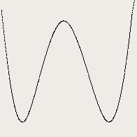

# Interpolation

Интерполяция  
Для всех задач в папке data в файлах train.dat и train.ans
вбить начальные значения X и Y соответственно, в test.dat поместь аргементы для вычисления значений  
Ответ будет записан в файл test.ans
***
Линейная интерполяция  
Линейная интерполяция — интерполяция алгебраическим двучленом P(x) = ax + b функции f, заданной в двух точках x0 и x1  
 
***
Интерполяционный многочлен Лагранжа  
Интерполяционный многочлен Лагранжа — многочлен минимальной степени, принимающий данные значения в данном наборе точек.  
 
***
Интерполяция сплайнами  
Кубический сплайн — гладкая функция, область определения которой разбита на конечное число отрезков, на каждом из которых она совпадает с некоторым кубическим многочленом (полиномом)  

***
    
